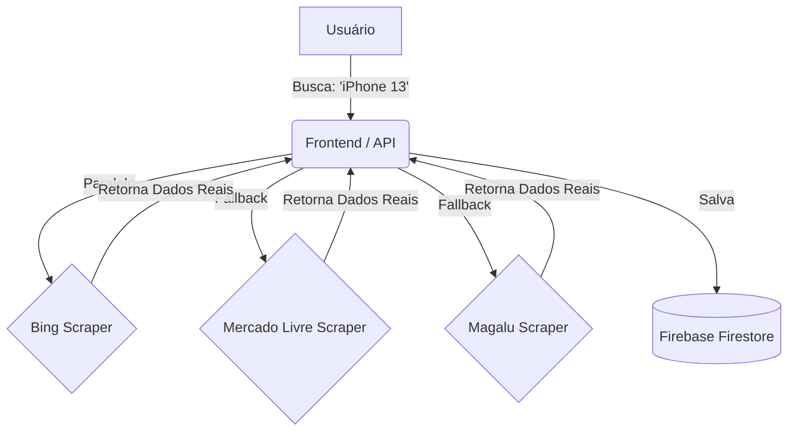

# 🛒 Smart Price Web Scraping

<div align="center">


**Monitoramento de Preços Inteligente com Dados Reais**
<br/>
*Busca em múltiplos e-commerces, contorna bloqueios e entrega as melhores ofertas.*

[Instalação](#-instalação) • [Como Funciona](#-como-funciona) • [API](#-api) • [Segurança](#-arquitetura-de-segurança)

</div>

---

## ⚡️ O Que Este Projeto Faz?

Diferente de scrapers comuns que quebram com qualquer mudança de CSS ou bloqueio de IP, o **Smart Price** utiliza uma abordagem híbrida robusta:

1.  **🔍 Bing Shopping Aggregation**: Usa o Bing como "proxy" natural para buscar preços em centenas de lojas (Amazon, KaBuM!, Mercado Livre) sem ser bloqueado.
2.  **🧩 Heurística Visual**: Ao navegar nas lojas (fallback), nossos robôs não dependem apenas de nomes de classes (`.price`), mas analisam a estrutura visual (Texto de preço `R$` + Imagem + Link) para identificar produtos.
3.  **🥷 Modo Stealth**: Simula nuancias de comportamento humano (mouse, user-agent dinâmico) para passar despercebido por firewalls.
4.  **💾 Histórico Cloud**: Salva todas as buscas no **Firebase Firestore** para análise de dados.

---

## 📁 Estrutura do Projeto



---

## 🚀 Instalação (Passo a Passo)

### 1. Preparar Ambiente
```bash
# Clone o repositório
git clone https://github.com/LeoRodrigues290/Smart-Price-Web-Scraping-.git
cd Smart-Price-Web-Scraping-

# Ambiente Virtual
python3 -m venv venv
source venv/bin/activate

# Dependências
pip install -r requirements.txt
playwright install chromium
```

### 2. Configurar Segurança 🔐
O projeto **não** salva chaves no código. Você precisa criar um arquivo `.env` na raiz:

```ini
# Conteúdo do arquivo .env
FIREBASE_API_KEY="AIzaSy..."
FIREBASE_PROJECT_ID="smart-price-..."
GOOGLE_APPLICATION_CREDENTIALS="serviceAccountKey.json"
```

### 3. Gerar Config do Frontend
Como o frontend é estático (JS), ele precisa de um arquivo de config gerado seguramente:

```bash
# Este script lê seu .env e cria o arquivo frontend/firebase_config.js
python3 scripts/setup_config.py
```

### 4. Rodar 🏃‍♂️
```bash
# Inicia o Backend (API)
uvicorn backend.main:app --reload
```
Acesse `http://127.0.0.1:8000` ou abra o `frontend/index.html` no navegador.

---

## 🔒 Arquitetura de Segurança

Este projeto segue práticas rigorosas para evitar vazamento de dados:

*   ✅ **Ignored by Default**: Arquivos `.env`, `*.json` (chaves) e `firebase_config.js` estão no `.gitignore`.
*   ✅ **Git History Scrub**: O histórico do Git foi auditado e limpo para garantir que nenhuma chave antiga permaneça.
*   ✅ **Config Generation**: Credenciais do frontend são injetadas apenas em tempo de deploy/setup local, nunca commitadas.

---

## 🛠 endpoints da API

| Método | Endpoint | Descrição |
| :--- | :--- | :--- |
| `GET` | `/api/search?q=item` | Busca produtos em todas as fontes (Bing, ML, Magalu) |
| `GET` | `/api/suggestions?q=termo` | (Futuro) Autocomplete de termos de busca |

---

<div align="center">
Desenvolvido com 💜 por Leo Rodrigues
</div>
