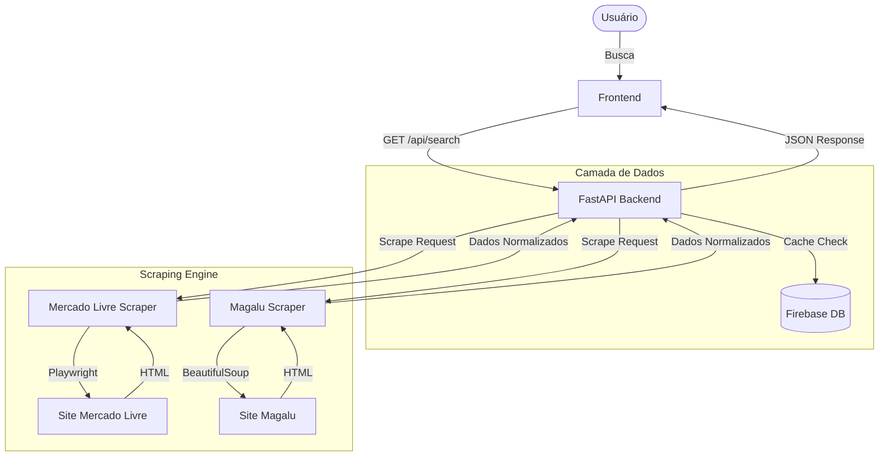

# 🦅 Smart Price - Monitoramento Inteligente de Preços


> **Encontre o melhor preço em segundos.** 
> Sistema de web scraping com arquitetura moderna, capaz de buscar produtos em múltiplos e-commerces simultaneamente.

---

## 📸 Preview

*Em breve: Screenshots da interface*

---

## 🚀 Tecnologias Utilizadas

### Backend (API)
- **FastAPI**: Performance ultra-rápida e documentação automática (Swagger UI).
- **Playwright**: Automação de navegador para scraping de sites dinâmicos (Mercado Livre, etc).
- **BeautifulSoup4**: Parseamento de HTML.
- **Firebase Admin SDK**: Persistência de dados e cache de buscas.

### Frontend
- **HTML5 / CSS3 / Vanilla JS**: Interface leve e responsiva.
- **TailwindCSS**: Estilização moderna via CDN.

---

## 🏗️ Arquitetura do Projeto



---

## 📦 Como Rodar o Projeto

### Pré-requisitos
- Python 3.9+
- Node.js (opcional, apenas se quiser rodar ferramentas de front específicas)
- Conta no Firebase (para credenciais)

### Passo 1: Clone o Repositório
```bash
git clone https://github.com/seu-usuario/smart-price-scraper.git
cd smart-price-scraper
```

### Passo 2: Configurar Ambiente Virtual
```bash
# Criar venv
python3 -m venv venv

# Ativar venv
# Windows:
venv\Scripts\activate
# Mac/Linux:
source venv/bin/activate
```

### Passo 3: Instalar Dependências
```bash
pip install -r requirements.txt

# Instalar navegadores do Playwright
playwright install chromium
```

### Passo 4: Configurar Variáveis de Ambiente
Crie um arquivo `.env` na raiz baseado no exemplo:
```bash
cp .env.example .env
```
*Edite o arquivo `.env` apontando para suas credenciais do Firebase.*

### Passo 5: Executar
```bash
# Iniciar o servidor de desenvolvimento
uvicorn backend.main:app --reload
```
Acesse:
- **Frontend**: `http://localhost:8000/frontend/index.html` (ou abra o arquivo direto no navegador)
- **Documentação da API**: `http://localhost:8000/docs`

---

## 🚧 Status do Desenvolvimento

- [x] **Fase 1**: Estrutura do Projeto & Setup
- [x] **Fase 2**: Interface de Busca & Debounce
- [x] **Fase 3**: Integração Firebase & API Sugestões
- [x] **Fase 4**: Scraper Mercado Livre (Playwright + Fallback)
- [ ] **Fase 5**: Scraper Magazine Luiza & Paralelismo
- [ ] **Fase 6**: Polimento & UX

---

## 🤝 Contribuição

Sinta-se à vontade para abrir Issues ou Pull Requests. Vamos construir o melhor comparador de preços open-source!

---

*Desenvolvido com 💙 por Leo Rodrigues.*
